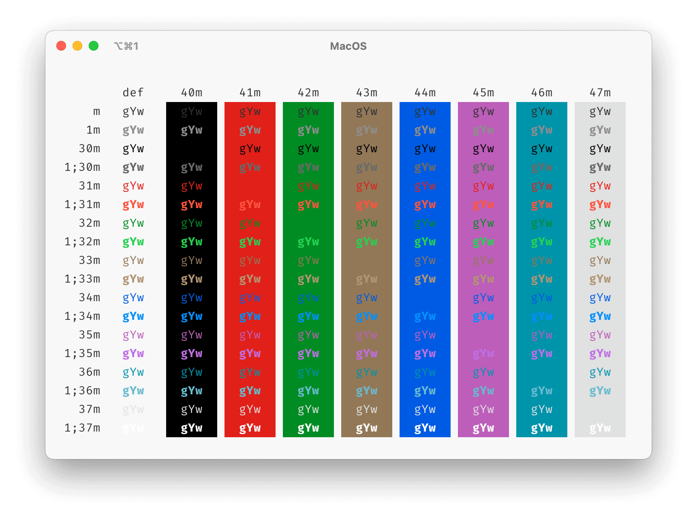
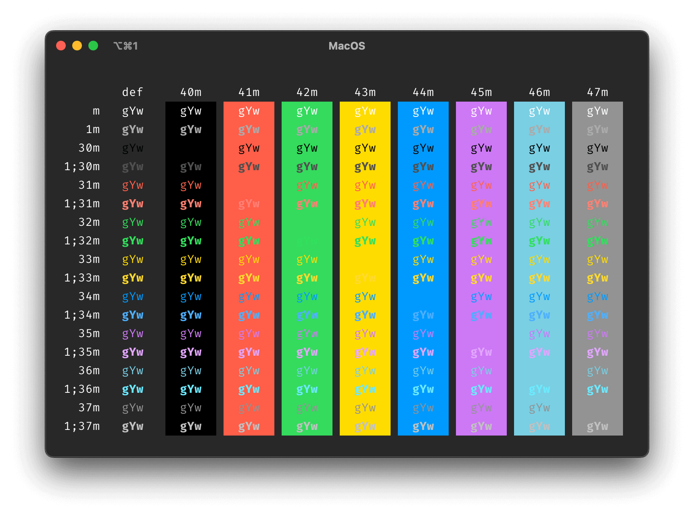

# MacOS Native iTerm Colors

This is a color scheme for iTerm based on colors
from Apple's [Human Interface Guidelines](https://developer.apple.com/design/human-interface-guidelines/foundations/color) ([archived](https://web.archive.org/web/20221228144127/https://developer.apple.com/design/human-interface-guidelines/foundations/color)).
It's designed to blend smoothly into native MacOS UI.

Theme is designed for **iTerm 3.5+** that supports light and dark color schemes
simultaneously as well as switching between them based on the system settings.

The color scheme should be compatible with older versions,
however this was not tested.
In case you use it with iTerm 3.4 or an older version,
the default color scheme is **light**.
This is arbitrary, it could be changed, contributions are welcomed.

[Download](https://raw.githubusercontent.com/viktor-yakubiv/macos.itermcolors/main/MacOS.itermcolors)

## Screenshots

## Design Process

Colors were gathered directly from the system
with help of a basic Swift script.

Then the values were processed manually and put [into CSS](./src/theme.scss),
processed with [some Sass scripts](./src/library.scss)
to define the [final spec](./src/spec.scss).
CSS spec is converted to [JSON](./MacOS.json)
that is transformed into [XML](./MacOS.itermcolors) (`.itermcolors`)
with help of Nunjacks.

Please, go through the [source directory](./src) if you want to know more.

## License

The color scheme as a file is licensed under [MIT](./LICENSE).
Color palette itself is licensed under Apple's Terms and Conditions.
